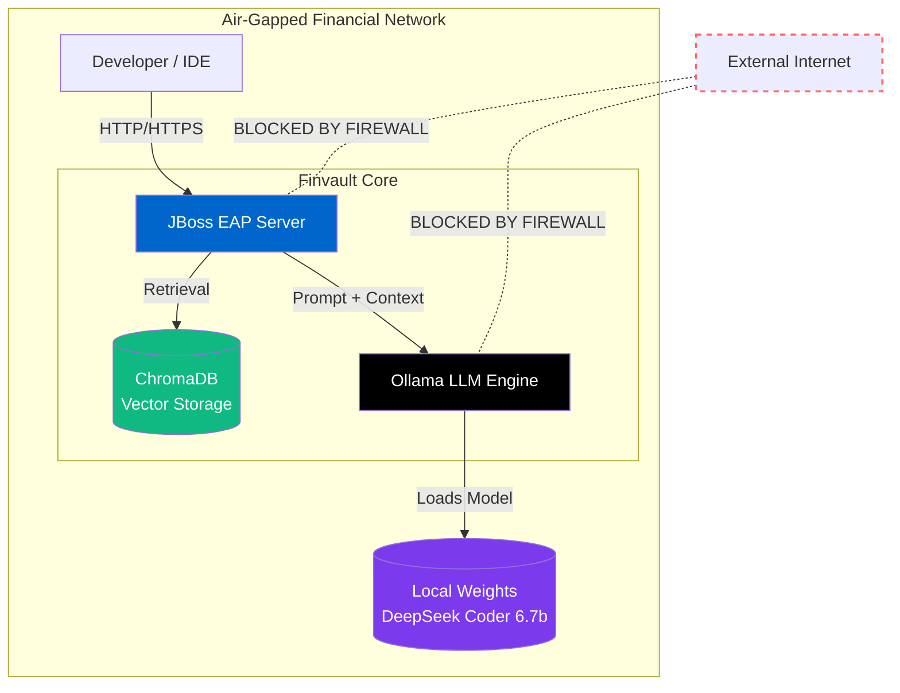

# 🛡️ Finvault: Air-Gapped AI Coding Assistant


---

## 📌 The Problem
In strict financial and enterprise environments, connecting to cloud-based LLMs (like OpenAI or Claude) is strictly prohibited due to **data privacy and air-gapped network policies**.
How can developers leverage the power of AI coding assistants without sending a single byte of confidential codebase to the outside world?

---

## 💡 The Solution
Finvault is a reference architecture and deployment guide for running a **100% offline, locally hosted AI coding assistant**.
By combining **Ollama** (for local LLMs), **ChromaDB** (for RAG), and enterprise middleware (**JBoss EAP**), this project delivers intelligent code generation with complete data sovereignty.

> **No internet. No data leaks. Complete control.**

---

## 🏗️ Architecture Overview



---

## 🔧 Tech Stack

| Component | Technology | Description |
|---|---|---|
| LLM Engine | Ollama | Local LLM server (CPU only) |
| AI Model | DeepSeek Coder 6.7b | Code-specialized LLM |
| Vector DB | ChromaDB | RAG document storage |
| Middleware | JBoss EAP 8.1 | Enterprise WAS |
| Framework | Spring Boot 4.0.5 | Backend framework |
| Build Tool | Gradle | Build & deploy automation |
| JDK | JDK 21 | Isolated install (no system env) |
| IDE | STS 5.1.1 + VS Code | Development environment |

---

## 📁 Project Structure

```text
C:\projects
├─ AI\          ← Ollama LLM Server (AI Engine)
├─ FinAI\       ← AI Coding Assistant POC (Relay Server)
├─ FinVault\    ← Main Project (Spring Boot WAR)
└─ was\         ← JBoss EAP 8.1 Server
```

---

## 🚀 Roadmap

- [x] JBoss EAP 8.1 + Spring Boot 4.0.5 WAR Deployment
- [x] JDK 21 Isolated Installation
- [x] Gradle Auto-Deploy Script
- [x] Network Architecture Design (mTLS, Firewall Policy)
- [ ] Ollama Installation & DeepSeek Coder Setup
- [ ] ChromaDB + RAG Implementation
- [ ] VS Code + Continue.dev Integration
- [ ] GitLab On-Premises Setup
- [ ] Jenkins CI/CD Pipeline

---

## 📝 Blog Series (Korean)

> 📖 [시대를 역행하는 온프레미스 개발환경 구축기](https://finvault.tistory.com)

| # | Title |
|---|---|
|     | Spring Boot 4.0.5 + JBoss EAP 8.1 WAR 배포 삽질기 |
| 1탄 | 프로젝트 소개 & 기술스택 & 환경 구성 철학 |
| 2탄 | JDK21 독립 설치 & JBoss EAP 8.1 설치 |
| 3탄 | JBoss EAP 8.1 환경설정 & 구동 확인 |
| 4탄 | STS 설치 & JBoss 서버 연동 |
| 5탄 | WAR 배포 실패 1 - Logback 충돌 |
| 6탄 | WAR 배포 실패 2 - spring-web 누락 & tomcat-runtime |
| 7탄 | Gradle deployToJBoss 자동배포 완성 |
| 8탄 | 금융권 폐쇄망 온프레미스 AI 아키텍처: Ollama 도입부터 mTLS 보안 설계까지 |
| 9탄 | 폐쇄망(Air-Gapped)에 오프라인 AI 엔진 욱여넣기: Ollama & DeepSeek GGUF |
| 10탄 | VS Code Portable 격리 세팅 및 continue.dev를 통한 Ollama 연동 (작성 중) |
---

## 🏛️ Design Philosophy

❌ No system environment variable modification
❌ No shared JDK usage
✅ Everything self-contained within project folder
✅ Reproducible with single setup.bat
✅ Deployable in air-gapped environments

---

## 💬 Contributions & Feedback

Experiences from similar environments (financial sector, air-gapped networks) are highly welcome!

→ [Blog Comments](https://finvault.tistory.com)
→ [GitHub Issues](https://github.com/finvaultlabs/finvault/issues)

---

## 📄 License

Apache-2.0 License

---

> 💡 **This README is a living document.**
> Updated continuously as the project progresses.
